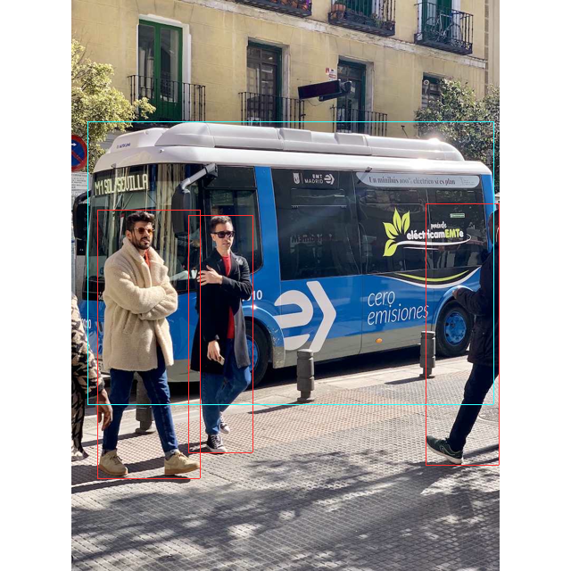

# yolov8-ort-rs

minimum demo of yolov8 detection with onnx and [pykeio/ort](https://github.com/pykeio/ort)

## How to run

```bash
git clone git@github.com:lzpel/yolov8-ort-rs
cd yolov8-ort-rs
cargo run --bin yolov8-ort-rs
```

Then, it runs inference with bus.jpg and generates output.png with bounding boxes of detected objects(bus, people)

